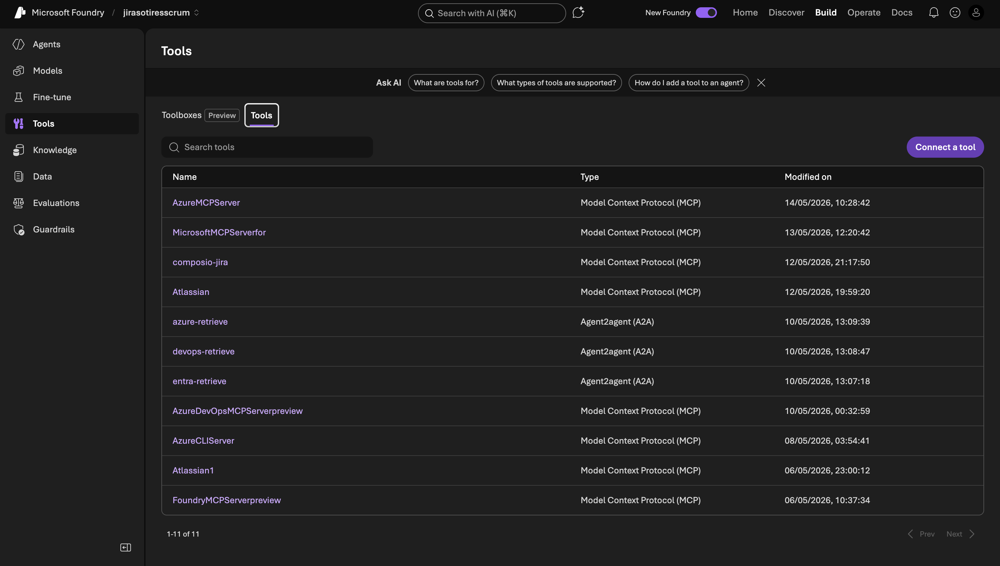

This chapter wires the Model Context Protocol (MCP) servers that give each agent its capabilities. Six servers in total — one is Composio (covered in detail in [chapter 04](/azure-multi-agent/04-jira-composio/)), the other five are Microsoft-hosted.

## Server inventory

| MCP server | Hosting | Used by | Purpose |
| --- | --- | --- | --- |
| AzureMCPServer | Microsoft (built-in) | AzureRetrieve | Native Azure RM operations (`subscription_list`, `storage_account_list`, `keyvault_secret_get`, etc.) |
| AzureCLIServer | Microsoft (built-in) | AzureRetrieve | `run_az` for any `az` command not covered by native tools |
| Foundry MCP Server | Microsoft (built-in) | AzureRetrieve | Foundry project introspection (models, deployments, agents) |
| Azure DevOps MCP | Microsoft (built-in) | Devops | DevOps reads — projects, repos, PRs, pipelines, work items |
| MicrosoftMCPEnterprise (Microsoft 365 MCP for Enterprise) | Microsoft (built-in) | MicrosoftEntra | Entra reads — users, groups, app registrations, devices |
| composio-jira | Composio Cloud | AzureRetrieve, Devops, MicrosoftEntra | Jira Story creation in SCRUM project |

ParentAgent and SubDiscovery do **not** get any of these except SubDiscovery, which gets just AzureMCPServer (`subscription_list` only).

## Adding a built-in MCP server to an agent

The five Microsoft-hosted servers are added the same way:

1. Open `ai.azure.com/nextgen` → **Agents** → pick your agent
2. Scroll to the **Tools** section
3. Click **Add**
4. Choose the MCP server from the list
5. The server auto-configures with the project MI for outbound auth
6. Click **Save** at the top of the agent page (a new version is created)

There is no extra config — these are first-party servers running in the same Foundry tenancy. The MI you wired in [chapter 02](/azure-multi-agent/02-permissions-identity/) is what governs what each server can do.



## Per-agent tool assignment

This is the source of truth for what each agent has attached. Match it exactly when configuring.

### ParentAgent

| Tool | Why |
| --- | --- |
| (none) | ParentAgent is a pure classifier. Adding any tool risks the LLM trying to "help" by calling it instead of emitting the routing token. |

### SubDiscovery

| Tool | Why |
| --- | --- |
| Azure MCP Server | Only uses `subscription_list`. The prompt explicitly forbids every other tool. |

### AzureRetrieve

| Tool | Why |
| --- | --- |
| Azure MCP Server | All Azure RM reads + nonprod writes for first-party namespaces |
| Azure CLI MCP Server | `run_az` for everything not in the native tool catalog (e.g., AKS scaling, SQL elastic pools) |
| Foundry MCP Server (preview) | "List the deployments in this Foundry project" type queries |
| composio-jira | Prod-write escalation |
| Web Search (Bing grounding) | Disabled in practice but present as an emergency fallback for unknown commands |

### Devops

| Tool | Why |
| --- | --- |
| Azure DevOps MCP Server (preview) | All DevOps reads |
| composio-jira | Write-escalation (the Devops agent is read-only) |
| Web Search | Disabled but available |

### MicrosoftEntra

| Tool | Why |
| --- | --- |
| Microsoft MCP Server for Enterprise (preview) | Entra reads — users, groups, apps, devices, org info |
| composio-jira | Write-escalation (read-only agent) |
| Web Search | Disabled but available |

## Verifying a server works in isolation

Before wiring an agent, you can test the MCP server directly from the agent **Playground**:

1. Open the agent
2. Make sure only the one tool you're testing is attached
3. In the playground chat, type a deterministic command. For AzureMCPServer:

   ```
   List all subscriptions in tenant 6577bae2-a3fd-40d6-a992-949168c7ca0f
   ```
4. Watch the **Logs** panel — you should see `subscription_list` invoked and the response

If the call fails with 401 or 403, the MI doesn't have RBAC. Revisit [chapter 02](/azure-multi-agent/02-permissions-identity/). If the call succeeds in Playground but fails inside the workflow, the issue is workflow input wiring (covered in [chapter 06](/azure-multi-agent/06-workflow/)).

## Refreshing / removing a server

MCP servers in preview occasionally bump versions and break compatibility. The signs:

- Tool list disappears from the agent
- "Tool not found" errors in workflow Traces
- Agent emits "I'm sorry, I can't help with that" for a request that previously worked

Fix:

1. Remove the broken server from the agent's Tools list
2. Re-add it
3. Save the agent (this creates a new version)
4. Republish any workflow that referenced this agent

The agent version reference inside a workflow is by **name**, not version number, so saving a new version of the agent immediately takes effect in any workflow pointing at it.

## Cost considerations

Built-in MCP servers cost nothing extra — they run in the Foundry control plane. You pay only for the model tokens.

Composio Jira has its own pricing (separate workspace, free tier is 100 calls/day at the time of writing). If you saturate the free tier, batch the Jira tickets or set up a queue.

Web Search uses Grounding with Bing and is metered separately. Leave it disabled unless you actually need it — at one point each grounded turn was ~$0.005 USD.

## What's next

You have five Microsoft-hosted MCP servers attached to the right agents. The sixth — composio-jira — needs a Composio workspace and a Jira app connection. That's [chapter 04](/azure-multi-agent/04-jira-composio/).
