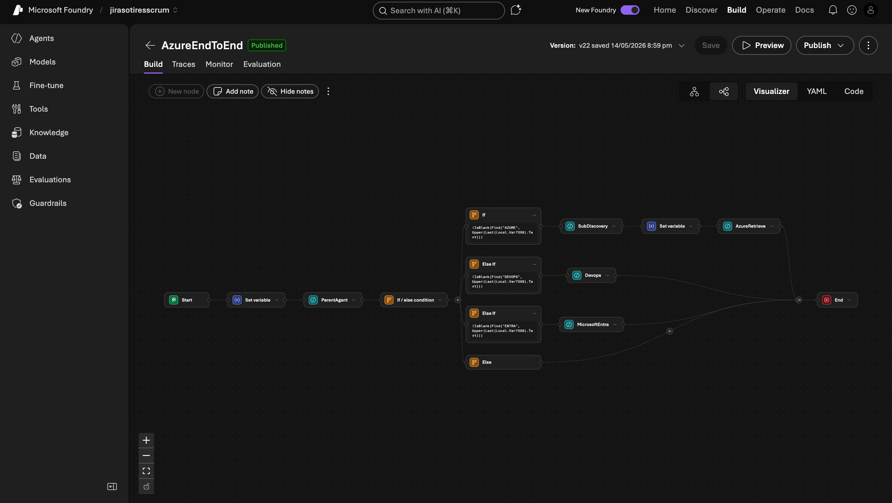

The `AzureEndToEnd` workflow is the user-facing entry point. It captures the user message, classifies it via ParentAgent, routes to the appropriate domain agent, and returns the answer.

## Workflow shape



Logical structure:

```text
Start
  ↓
Set variable (Local.OriginalRequest = user's first message)
  ↓
ParentAgent (emits AZURE / DEVOPS / ENTRA / GREETING / UNKNOWN)
  ↓
If / Else condition
  ├─ If    !IsBlank(Find("AZURE",  Upper(Last(Local.Var7398).Text)))
  │       → SubDiscovery → Set variable (Local.AzureInput) → AzureRetrieve → End
  ├─ Else If !IsBlank(Find("DEVOPS", Upper(Last(Local.Var7398).Text)))
  │       → Devops → End
  ├─ Else If !IsBlank(Find("ENTRA",  Upper(Last(Local.Var7398).Text)))
  │       → MicrosoftEntra → End
  └─ Else
          → fallback / greeting response → End
```

## Variables in play

| Variable | Type | Lifetime | Purpose |
| --- | --- | --- | --- |
| `Local.OriginalRequest` | Text | per turn | The raw user message |
| `Local.Var7398` | Conversation | per turn | The Parent agent's response messages (used in If/Else `Last(...).Text`) |
| `Local.SubInfo` | Conversation | per turn | SubDiscovery's response messages |
| `Local.AzureInput` | Text | per turn | Combined `"Available subs: ... . User request: ..."` for AzureRetrieve |
| `System.ConversationId` | Text | persistent | Foundry conversation handle — keeps per-agent memory across user turns |

The variable names with `Var<number>` suffixes are auto-generated by Foundry when a node creates an output. Rename them via the node's settings panel; the workflow YAML reflects the names.

## Step 1 — Start node

No configuration. Every workflow has one. It fires when a user message arrives on the workflow's chat endpoint.

## Step 2 — Set variable (capture user message)

Add a **Set variable** node immediately after Start.

| Field | Value |
| --- | --- |
| Variable name | `Local.OriginalRequest` |
| Type | Text |
| Value (Power FX) | `Last(System.Conversation.Messages).Text` |

This pulls the most recent user message out of the conversation history and freezes it in a Text variable so downstream nodes can reference it directly without re-parsing the conversation.

## Step 3 — ParentAgent node

Add an **Agent** node.

| Setting | Value |
| --- | --- |
| Select agent | `ParentAgent` |
| Conversation context | `System.ConversationId` |
| Input message | `Local.OriginalRequest` |
| Allow multi-turn conversation | OFF |
| Automatically include agent response in conversation | OFF |
| Save agent output message as | `Local.Var7398` (auto-named — keep as-is or rename) |

Multi-turn is OFF because ParentAgent is a stateless classifier — it should re-classify each turn, not remember prior classifications. "Include in conversation" is OFF because the user shouldn't see the raw token `AZURE` in chat.

## Step 4 — If / Else condition node

Add a **Logic → If/else** node.

Configure four branches in this order (top matches first):

### Branch 1 — If

Condition (Power FX):

```
!IsBlank(Find("AZURE", Upper(Last(Local.Var7398).Text)))
```

This says: in the latest message from the Parent agent's output, is the literal string `AZURE` present? The `Upper()` wrap makes it case-insensitive.

### Branch 2 — Else If

```
!IsBlank(Find("DEVOPS", Upper(Last(Local.Var7398).Text)))
```

### Branch 3 — Else If

```
!IsBlank(Find("ENTRA", Upper(Last(Local.Var7398).Text)))
```

### Branch 4 — Else

(No condition — catches anything that didn't match above, including UNKNOWN and GREETING.)

If you want a dedicated GREETING branch, insert another Else If between Branch 3 and the catch-all Else:

```
!IsBlank(Find("GREETING", Upper(Last(Local.Var7398).Text)))
```

And wire it to a response node containing the welcome text.

## Step 5 — AZURE branch chain

### 5a — SubDiscovery agent node

| Setting | Value |
| --- | --- |
| Select agent | `SubDiscovery` |
| Conversation context | `System.ConversationId` |
| Input message | `Local.OriginalRequest` |
| Allow multi-turn conversation | OFF |
| Automatically include agent response in conversation | OFF |
| Save agent output message as | `Local.SubInfo` |

Output is hidden from the user (intermediate data). SubDiscovery's prompt explicitly ignores `Local.OriginalRequest`, so it doesn't matter that we pass it — but every agent node requires an input, and the `OriginalRequest` is what we have.

### 5b — Set variable (combine subs + user request)

Add a **Set variable** node between SubDiscovery and AzureRetrieve.

| Field | Value |
| --- | --- |
| Variable name | `Local.AzureInput` |
| Type | Text |
| Value (Power FX) | `"Available subs: " & Last(Local.SubInfo).Text & " . User request: " & Local.OriginalRequest` |

Two gotchas in this expression:

1. **`Last(Local.SubInfo).Text`** — `Local.SubInfo` is a *conversation* (table of messages), so you need `Last(...)` to pull the last message and `.Text` to extract the string content. Trying to concatenate `Local.SubInfo` directly fails with `Invalid argument type. Expecting one of: Text, Guid, Number, ...`.
2. **`Local.OriginalRequest`** — already Text, so no wrapping needed. Wrapping it in `Last(...)` causes `Expecting a Table value instead`.

Match these types correctly or the SetVariable node errors at workflow runtime.

### 5c — AzureRetrieve agent node

| Setting | Value |
| --- | --- |
| Select agent | `AzureRetrieve` |
| Conversation context | `System.ConversationId` |
| Input message | `Local.AzureInput` |
| Allow multi-turn conversation | OFF |
| Automatically include agent response in conversation | **ON** |
| Save agent output message as | `Local.Var2514` (auto-named — fine) |

"Include in conversation" is **ON** for the terminal answer agents — this is what surfaces the response in the user's chat. If it's OFF, the workflow ends silently with nothing shown.

### 5d — End

Wire AzureRetrieve's success path to the End node.

## Step 6 — DEVOPS branch

### 6a — Devops agent node

| Setting | Value |
| --- | --- |
| Select agent | `Devops` |
| Conversation context | `System.ConversationId` |
| Input message | `Local.OriginalRequest` |
| Allow multi-turn conversation | OFF |
| Automatically include agent response in conversation | ON |

No sub-discovery needed — DevOps has its own organization scope (`admin45`) baked into the agent prompt.

### 6b — End

## Step 7 — ENTRA branch

### 7a — MicrosoftEntra agent node

Same pattern as Devops:

| Setting | Value |
| --- | --- |
| Select agent | `MicrosoftEntra` |
| Conversation context | `System.ConversationId` |
| Input message | `Local.OriginalRequest` |
| Allow multi-turn conversation | OFF |
| Automatically include agent response in conversation | ON |

### 7b — End

## Step 8 — Else (fallback) branch

This catches UNKNOWN classifications (and GREETING if you didn't add a dedicated branch). Two sensible options:

**Option A — Static fallback response node:**

```
I can help with Azure resources, Azure DevOps, or Microsoft Entra ID.
Try something like:
  - "list storage accounts"
  - "show repos in admin45"
  - "list users in entra"
```

**Option B — Re-prompt the user with a menu via "Ask a question":**

```
Which area do you want to manage?
  1. Azure resources
  2. Azure DevOps
  3. Microsoft Entra ID
```

The first version is recommended for the production build — fewer round trips, faster path to answer.

## Multi-turn behaviour

Foundry does not have a workflow-level multi-turn switch. Each user message re-enters the workflow from Start. Per-agent **Conversation context** set to `System.ConversationId` is what carries history forward — when AzureRetrieve sees a new turn, it has access to the prior messages it generated, so follow-ups like "now show key vaults" still have context.

The per-agent `Allow multi-turn conversation` toggle is for *in-turn* iteration (agent asks user a clarifying question, user responds, agent continues — all within one workflow execution). For this build we leave it OFF on every agent and rely on the workflow restart + ConversationId memory pattern.

## Saving and versioning

Every save creates a new version (`v1`, `v2`, …). The numbering goes high quickly during iteration — at the time of writing this build is on `v22+`. To roll back:

1. Click the version dropdown next to the workflow title
2. Select a prior version
3. Click **Restore** (this becomes the new latest)

Foundry doesn't have a YAML export button per version directly, but the **YAML** tab on the current version shows the workflow definition. Copy that into a git repo as your durable backup.

## Verifying the build

Run these test inputs in **Preview** after each major change:

| Input | Expected outcome |
| --- | --- |
| `hi` | Welcome text (if GREETING branch is wired) |
| `list storage accounts` | Labelled Prod / Nonprod storage tables |
| `find storage account named X` | Asks "which env — prod or nonprod?" |
| `show me pipelines` | Devops returns project + pipeline list |
| `list users` | MicrosoftEntra returns user table |
| `random gibberish` | Fallback / menu response |

If any of these misroute, the most common cause is the If/Else condition order — earlier branches match first.

## What's next

The workflow is complete and tested. Next chapter explains the per-environment policies — when the agent files Jira vs creates resources.

Continue to [Prod vs non-prod handling](/azure-multi-agent/07-prod-vs-nonprod/).
